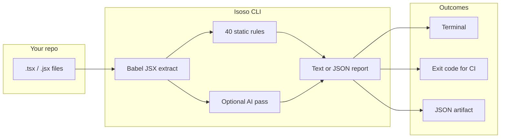

<div align="center">


### Accessibility testing for developers who ship React & TypeScript

**Static WCAG-oriented rules in your terminal · Optional AI review · CI-ready JSON reports**

<br />

[](https://nodejs.org/)
[](LICENSE)
[](https://www.npmjs.com/package/@isoso.dev/isoso)

*Catch alt text gaps, keyboard traps, and unlabeled controls before they reach production.*

</div>

---

## Table of contents

- [What Isoso does](#what-isoso-does)
- [Install](#install)
- [Quick start](#quick-start)
- [Commands](#commands)
  - [`isoso scan`](#isoso-scan)
  - [`isoso rules`](#isoso-rules)
  - [`isoso explain`](#isoso-explain)
- [Built-in rules](#built-in-rules)
- [Static vs AI scanning](#static-vs-ai-scanning)
- [CI integration](#ci-integration)
- [Monorepo layout](#monorepo-layout)
- [Developing Isoso](#developing-isoso)
- [Isoso Cloud](#isoso-cloud)
- [License](#license)

---

## What Isoso does

Isoso reads your **`.tsx` / `.jsx`** source (not the live DOM) and flags patterns that commonly break **WCAG** expectations—missing `alt` text, clickable `<div>`s without roles, unlabeled inputs, and more.



| Mode | When to use |
|------|-------------|
| **Static rules** | Fast, free, deterministic—ideal for CI and pre-commit |
| **AI scan** | Deeper pass on each file when you set an AI key; findings use the **same rule IDs and severities** as static mode |
| **Explain** | Turn a finding into impact + remediation narrative (AI or built-in copy) |

> **Note:** Isoso is **source-level** analysis. It complements—not replaces—browser tools (axe, Lighthouse), screen reader testing, and manual QA.

**Isoso Cloud** (dashboard, org analytics, GitHub-connected scans, policies) is a separate product. **This repository** is the open-source CLI and rule engine (**Phase 1**).

---

## Install

**npm package:** [`@isoso.dev/isoso`](https://www.npmjs.com/package/@isoso.dev/isoso) (scoped). There is **no** unscoped `isoso` package on npm—the name is reserved/blocked. The **CLI command** is still `isoso`.

**Requirements:** Node.js **18+**

### Run once (no `package.json` change)

Use the **scoped** name with `npx`:

```bash
npx @isoso.dev/isoso scan
npx @isoso.dev/isoso rules
npx @isoso.dev/isoso explain --rule img-missing-alt --file src/App.tsx --line 12
```

Pin a version when you care about reproducibility:

```bash
npx @isoso.dev/isoso@0.3.0 scan
```

### Add to the repo you scan (typical)

Install as a dev dependency **in the app you want to scan**, not in unrelated projects:

```bash
npm install -D @isoso.dev/isoso
```

Then run the **`isoso`** binary from that project (local install or npm scripts):

```bash
npx isoso scan
isoso rules
```

`npx isoso …` uses `node_modules/.bin/isoso` after install. **`npm @isoso.dev/isoso`** is not valid—`npm` expects subcommands like `install`, not a package name.

### Global install (optional)

```bash
npm install -g @isoso.dev/isoso@latest
isoso scan
isoso --version
```

Global `isoso` does **not** auto-update when a new version is published. After upgrades on npm, run `npm install -g @isoso.dev/isoso@latest` again (or keep using `npx @isoso.dev/isoso@latest …`).

| You type | When it works |
|----------|----------------|
| `npx @isoso.dev/isoso scan` | Always (downloads/runs the published CLI) |
| `npx isoso scan` | After `npm install -D @isoso.dev/isoso` in this directory |
| `isoso scan` | After local install (npm script / `node_modules/.bin`) or **global** install |
| `npm @isoso.dev/isoso …` | **Never** — use `npm install` or `npx` |

---

## Quick start

```bash
# Scan the current directory (AI if ISOSO_AI_KEY is in .env, else static rules)
npx @isoso.dev/isoso scan

# Or, after npm install -D @isoso.dev/isoso in this repo:
npx isoso scan

# Scan a sample app in this monorepo (after clone + build)
npx isoso scan examples/sample-app

# Static only—no API calls
npx @isoso.dev/isoso scan --static

# JSON for pipelines + fail the job on serious+ findings
npx @isoso.dev/isoso scan --format json -o isoso-report.json --fail-on serious

# See every rule id and WCAG mapping (40 rules)
npx @isoso.dev/isoso rules

# Explain one rule (AI when a key is set)
npx @isoso.dev/isoso explain --rule img-missing-alt --file src/App.tsx --line 12
```

**Suggested `package.json` script:**

```json
{
  "scripts": {
    "a11y": "isoso scan --static --fail-on serious",
    "a11y:report": "isoso scan --format json -o isoso-report.json"
  }
}
```

---

## Commands

### `isoso scan`

Scan a project tree for accessibility issues in JSX/TSX.

```bash
isoso scan [path] [options]
```

| Option | Default | Description |
|--------|---------|-------------|
| `[path]` | `.` | Project root to scan |
| `-f, --format <type>` | `text` | `text` or `json` |
| `-o, --output <file>` | — | Write report to a file (stdout stays clean in JSON mode when combined with `-o`) |
| `--fail-on <severity>` | `serious` | Exit code **1** if any finding is **at or above** this severity (`critical`, `serious`, `moderate`, `minor`) |
| `--rules <ids>` | all | Comma-separated rule ids (e.g. `img-missing-alt,button-missing-name`) |
| `--static` | — | Force built-in rules only |
| `--ai` | — | Require AI scan (errors if `ISOSO_AI_KEY` is missing) |

**What gets scanned**

- **Glob:** `**/*.{tsx,jsx}`
- **Ignored:** `node_modules`, `dist`, `build`, `.next`, `coverage`

**Example text output (abbreviated)**

```text
Isoso accessibility scan
Engine: static rules
Root: /app
Files scanned: 42
Findings: 3

  critical: 1
  serious: 2

[critical] img-missing-alt — src/Hero.tsx:18:7
   is missing an alt attribute.
  Fix: Add alt="..." describing the image, or alt="" if decorative.

Completed in 124ms
```

---

### `isoso rules`

Print all static rules with **id**, human name, **severity**, and **WCAG** success criteria references.

```bash
isoso rules
```

Use the ids with `--rules` or `isoso explain --rule <id>`.

---

### `isoso explain`

Expand a finding into **Summary**, **Impact**, and **Remediation**.

```bash
isoso explain --rule <id> [options]
```

| Option | Description |
|--------|-------------|
| `--rule <id>` | **Required.** Rule id from `isoso rules` |
| `--file <path>` | File path for context |
| `--line <n>` | Line number (default `1`) |
| `--message <text>` | Override the finding message |
| `--snippet <text>` | Code snippet from your scan |
| `--builtin` | Curated WCAG guidance only—no API call |

**Environment:** `ISOSO_AI_KEY` in `.env` (see below). Optional `ISOSO_AI_MODEL`, `ISOSO_AI_BASE_URL`, or `ISOSO_AI_CHAT_URL` for your provider.

---

## Built-in rules

**40** static checks ship with `@isoso/core` (images, forms, keyboard, landmarks, media, tables, focus, and document structure). Severity drives `--fail-on` and CI gates.

List every rule id, WCAG reference, and severity:

```bash
npx @isoso.dev/isoso rules
```

Categories include: **text alternatives** (`img-missing-alt`, `svg-missing-accessible-name`, `role-img-missing-label`, …), **keyboard & focus** (`click-without-keyboard-handler`, `tabindex-zero-without-role`, `outline-none-utility`, …), **forms** (`input-missing-label`, `label-without-htmlfor`, `fieldset-needs-legend`, …), **links & buttons**, **landmarks** (`nav-missing-label`, `multiple-main-landmarks`, …), **media**, and **document** (`html-missing-lang`, `multiple-h1`).

Run a subset:

```bash
npx @isoso.dev/isoso scan --static --rules img-missing-alt,button-missing-name
```

---

## Static vs AI scanning

| | **Static (`--static`)** | **AI (default when key present)** |
|--|-------------------------|-----------------------------------|
| Speed | Very fast | Slower (per-file API calls) |
| Cost | Free | Provider usage (API billing) |
| Determinism | Same input → same output | May vary by model |
| Finding shape | `ruleId`, severity, WCAG, line, message, fix | **Same schema** as static rules |

**Auto behavior**

1. If `ISOSO_AI_KEY` is set → AI scan (unless `--static`).
2. If no key → static rules (CLI prints a yellow hint).
3. `--ai` → fail fast if no key.

**Setup**

1. Copy `.env.example` → `.env` in this repo **or** in the app where you run `isoso`.
2. Set `ISOSO_AI_KEY=...` (your provider’s API key)
3. Run `npx @isoso.dev/isoso scan` (omit `--static`), or `isoso scan` after a local install.

The CLI walks **upward** from the current working directory to find `.env`.

```bash
cp .env.example .env
# edit .env, then:
npx @isoso.dev/isoso explain --rule img-missing-alt --file src/App.tsx --line 24
```

Use `--builtin` on `explain` when you want zero network calls.

**Custom AI provider** (chat completions JSON API):

| Variable | Purpose |
|----------|---------|
| `ISOSO_AI_KEY` | API key sent as `Authorization: Bearer …` |
| `ISOSO_AI_MODEL` | Model id (default `gpt-4o-mini`) |
| `ISOSO_AI_CHAT_URL` | Full chat completions URL |
| `ISOSO_AI_BASE_URL` | Base URL; Isoso calls `{BASE}/chat/completions` |

---

## CI integration

Run **`isoso scan`** in any CI pipeline (GitHub Actions, GitLab CI, etc.). Exit code **`1`** when findings meet or exceed `--fail-on`.

```yaml
# Example GitHub Actions step
- run: npx @isoso.dev/isoso scan --static --format json --fail-on serious -o isoso-report.json
```

**Severity gate:** `--fail-on serious` fails on **critical** and **serious** findings. Use `--fail-on critical` for a looser gate, or `--fail-on moderate` for stricter.

**Tips**

- Prefer `--static` in CI for speed and predictable cost.
- Store `ISOSO_AI_KEY` in CI secrets only if you intentionally run AI in the pipeline.
- **GitHub org integration** (connect repos, PR scans, dashboard history) is **[Isoso Cloud](https://isoso.dev)** only—not part of this CLI.

---

## Monorepo layout

| Package | npm name | Role |
|---------|----------|------|
| `packages/isoso-cli` | **`@isoso.dev/isoso`** | CLI entrypoint (`scan`, `rules`, `explain`); binary name **`isoso`** |
| `packages/isoso-core` | `@isoso/core` | Rule engine, reports, AI scan + explain |
| `packages/isoso-scanner` | `@isoso/scanner` | Glob + Babel JSX extraction, orchestrates core |

Published **`@isoso.dev/isoso`** bundles vendored `@isoso/core` and `@isoso/scanner` for a single install.

---

## Developing Isoso

From the monorepo root:

```bash
npm install
npm run build
npm test                    # @isoso/core unit tests
npx isoso scan examples/sample-app
```

| Script | Action |
|--------|--------|
| `npm run build` | Build core → scanner → copy vendor → build CLI |
| `npm run dev` | Build and run CLI via Node |

**Sample violations:** `examples/sample-app/BadExample.tsx` intentionally breaks several rules—use it to verify scans locally.

---

## Isoso Cloud

Need **org-wide dashboards**, **GitHub-connected repo scans**, **teams**, **policies**, and **billing**? That lives in **Isoso Web / Cloud**, not in this CLI repo. The CLI remains the open-source local and CI story; cloud scans align on the **same rule IDs** where static heuristics apply.

---

## License

MIT — see [LICENSE](LICENSE).

---

<div align="center">

**Ship accessible UI earlier.** Run `npx @isoso.dev/isoso scan` on your app today.

</div>
